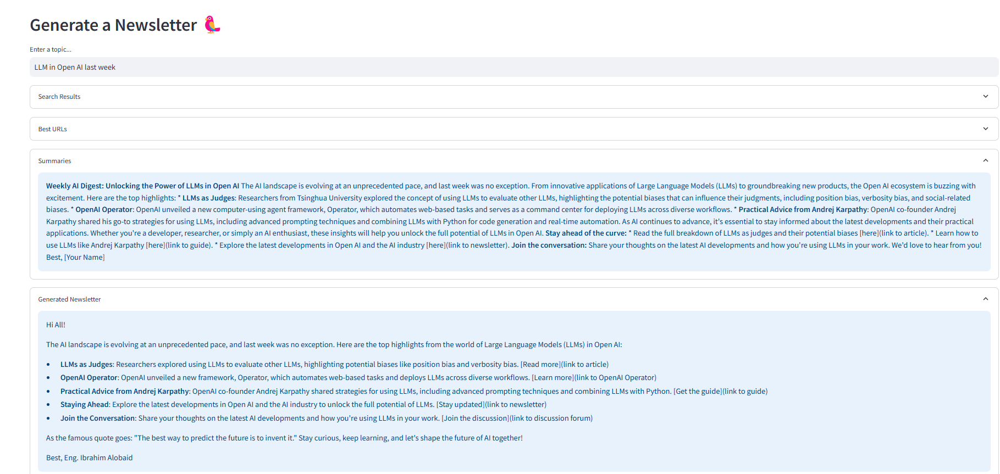

# 📰 AI-Powered Tech Newsletter Generator

## 📌 Overview
This project automates the process of generating a **technology newsletter** using **LangChain, FAISS, Streamlit, and LLaMA-3.3-70B (Groq API)**. The system searches for relevant articles, extracts key content, summarizes it, and generates a structured newsletter.

## 🚀 Features
✅ Automatically searches for relevant articles using **TavilySearchResults**.
✅ Uses **LLaMA-3.3-70B** for intelligent content selection.
✅ Extracts and indexes content in **FAISS** for efficient retrieval.
✅ Generates a structured **summary** for newsletters.
✅ Provides an interactive **Streamlit UI** for easy usage.
✅ Allows users to download the newsletter as **CSV**.

## 🛠️ Tech Stack
- **Python 3.9+**
- **LangChain** (LLM-powered text extraction & summarization)
- **FAISS** (Efficient document retrieval)
- **LLaMA-3.3-70B (Groq API)**
- **OpenAI Embeddings** (Text vectorization)
- **PyPDF** (Handling PDFs if needed in the future)
- **Pandas & NumPy** (Data processing)
- **Streamlit** (Web UI)

## 📂 Project Structure
```
📁 AI-Tech-Newsletter
│── 📝 README.md            # Documentation
│── 📄 project.py               # Utility functions for search, extraction, and summarization and Streamlit application
│── 📄 requirements.txt     # Dependencies
│── 📄 .env                 # API keys (Groq API key required)
```

## 📦 Installation & Setup
### 1️⃣ Clone the repository
```bash
git clone https://github.com/IbrahimAlobid2/AI-Tech-Newsletter.git
cd AI-Tech-Newsletter
```

### 2️⃣ Create a virtual environment
```bash
python -m venv venv
source venv/bin/activate  # macOS/Linux
venv\Scripts\activate     # Windows
```

### 3️⃣ Install dependencies
```bash
pip install -r requirements.txt
```

### 4️⃣ Set up API Keys
Create a `.env` file in the root directory and add your **Groq API key**:
```
GROQ_API_KEY=your_groq_api_key_here
```

### 5️⃣ Run the application
```bash
streamlit run app.py
```

## 🎯 Usage Instructions
1️⃣ Open the **Streamlit web interface** in your browser.
2️⃣ **Enter a topic** for the newsletter.
3️⃣ Click **"Generate Newsletter"**.
4️⃣ View the extracted articles, summaries, and **download the generated newsletter as CSV**.

## 🖼️ Screenshots

  

## 🛠️ Troubleshooting
### If `FAISS` fails to import:
```bash
pip uninstall faiss faiss-cpu -y
pip install faiss-cpu
```

### If search results are not accurate:
- Try **rephrasing the query** for better search results.

## 🤝 Contribution
We welcome contributions! Feel free to:
- Open an issue
- Submit a pull request
- Suggest improvements


